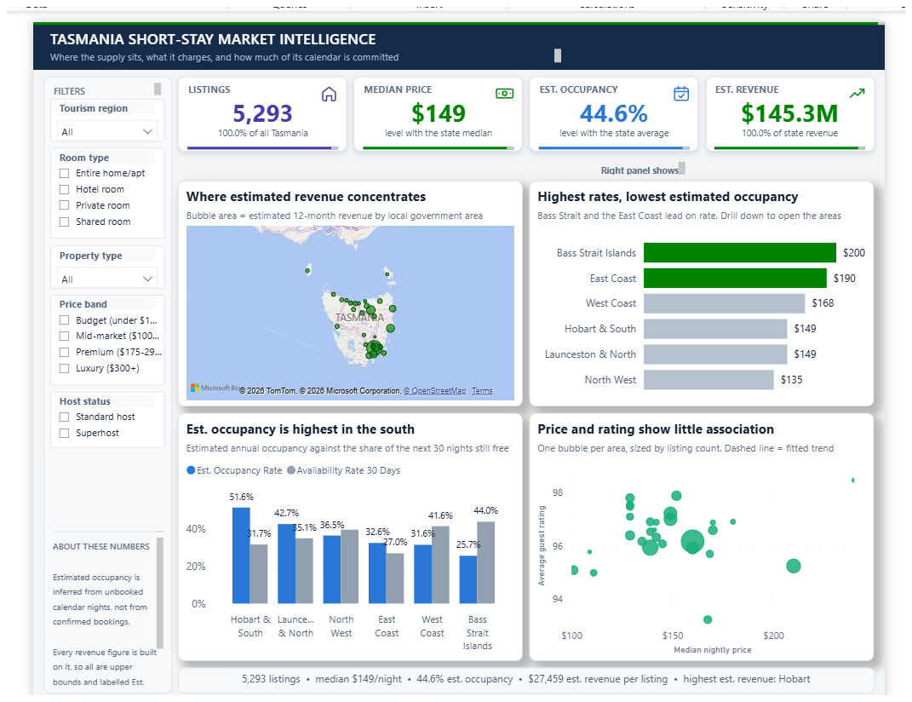
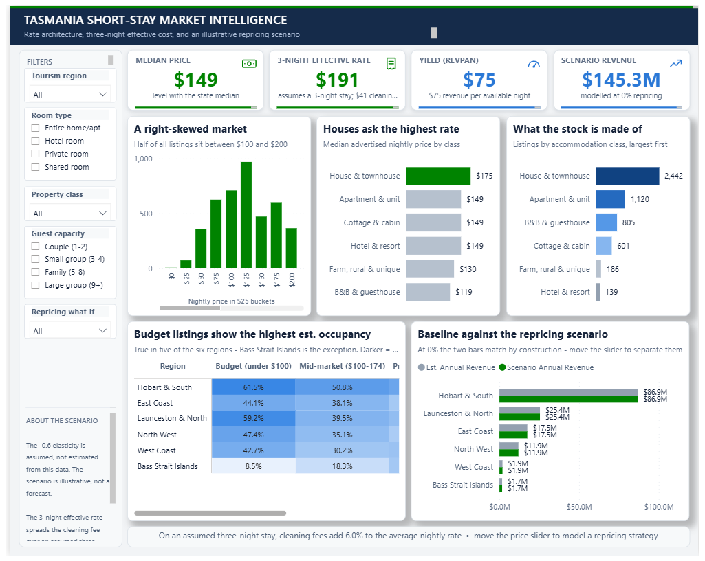
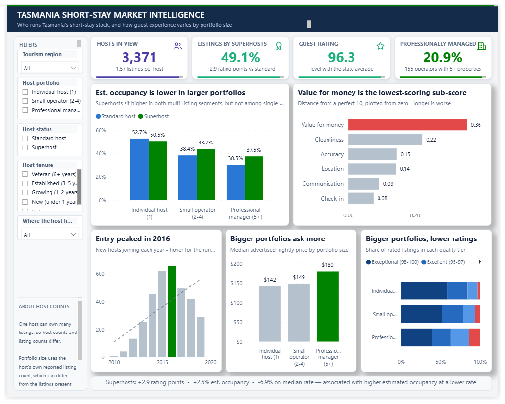
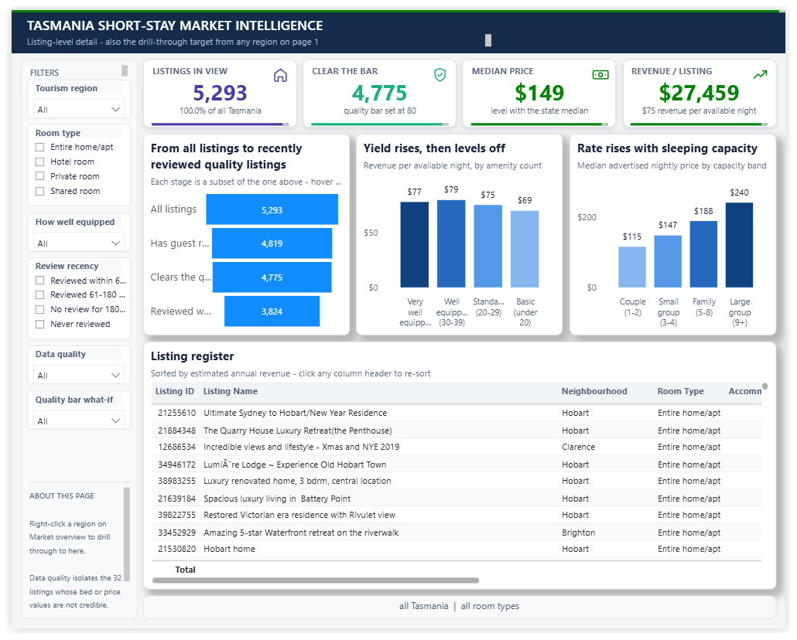

<div align="center">

# 🏝️ Tasmania Short-Stay Market Intelligence

### An interactive **Power BI** dashboard on Tasmania's short-term rental market
*Where the supply sits, what it charges, and how much of its calendar is committed*


</div>

<div align="center">



</div>

---

## 📊 Overview

This report examines Tasmania's short-term rental market from four angles: how the market is **structured**, how listings are **priced** and what they yield, **who runs the stock** and how guest experience varies, and how **individual listings** perform.

It pairs KPI cards with a geographic map, distribution and comparison charts, a drill-through register, and a hover tooltip — plus a **what-if repricing scenario** for revenue modelling.

> ⚠️ **On the estimates:** occupancy is *inferred from unbooked calendar nights*, not confirmed bookings, so every revenue figure is an upper bound and labelled *Est.* The repricing scenario uses an **assumed −0.6 price elasticity** — it is illustrative, not a forecast.

---

## 🔢 Key Figures

<div align="center">

| 🏠 Listings | 💵 Median Price | 📅 Est. Occupancy | 💰 Est. Revenue | 📈 Revenue / Listing |
|:---:|:---:|:---:|:---:|:---:|
| **5,293** | **$149** | **44.6%** | **$145.3M** | **$27,459** |

<sub><i>All of Tasmania · January 2020 snapshot</i></sub>

</div>

---

## 📄 The Five Pages

### 1️⃣ 🗺️ Market Overview — *where the supply sits*


Headline KPIs above a bubble map of estimated 12-month revenue by local government area. Regional rate rankings show **Bass Strait Islands ($200)** and the **East Coast ($190)** leading on price, while estimated occupancy peaks in the south (**Hobart & South, 51.6%**). A price-vs-rating scatter tests whether higher prices buy better reviews — they broadly don't.

**Filters:** tourism region · room type · property type · price band · host status

---

### 2️⃣ 💰 Pricing & Revenue — *rate architecture and a repricing what-if*



Moves from the advertised rate to what a guest actually pays: the **3-night effective rate of $191** folds in a $41 cleaning fee, adding **6.0%** to the average nightly rate. A right-skewed price histogram shows half of all listings between **$100 and $200**, alongside median rate and stock composition by property class (houses & townhouses dominate at **2,442** listings).

A regional × price-band occupancy matrix shows budget listings out-occupying mid-market in five of six regions, and the **repricing slider** drives a baseline-vs-scenario revenue comparison.

---

### 3️⃣ ⭐ Hosts & Guest Experience — *who runs the stock*



**3,371 hosts** hold the 5,293 listings (1.57 each), with **49.1%** of listings run by superhosts and **20.9%** professionally managed. The counter-intuitive finding: **larger portfolios ask more but rate lower** — professional managers charge a median **$180** vs **$142** for individual hosts, yet occupancy and rating tiers both slip as portfolio size grows.

Sub-score analysis isolates **value for money (0.36 off a perfect 10)** as the weakest dimension market-wide. Host entry peaked in **2016**.

<sub><b>Superhost effect:</b> +2.9 rating points · +2.5% est. occupancy · −6.9% on median rate</sub>

---

### 4️⃣ 🔎 Listing Explorer — *listing-level detail*



The **drill-through target** from any region on page 1. A funnel narrows 5,293 listings to the **4,775** that clear a user-set quality bar and the **3,824** reviewed recently. Yield by amenity count flattens quickly (RevPAN peaks around **$79**), while median rate climbs steeply with sleeping capacity — from **$115** for couples to **$240** for large groups.

The sortable listing register sits below, with a data-quality filter isolating **32 listings** whose bed or price values aren't credible.

---

### 5️⃣ 🧭 Area Snapshot — *tooltip page*

<div align="center">


</div>

A hover tooltip surfacing listings, median price, estimated occupancy, rating, and room-type mix for any area — context without leaving the page.

---

## 🖱️ Interactivity

| Element | Where it's used |
|:---|:---|
| 🎛️ **Slicers & filters** | Region, room type, property class, price band, host status, guest capacity, review recency, data quality |
| 🎚️ **What-if parameters** | Repricing scenario (revenue uplift) · quality-bar threshold |
| 🔀 **Drill-through** | Right-click a region on Market Overview → Listing Explorer |
| 🔎 **Drill-down** | Regional rate chart opens to area level |
| 💬 **Custom tooltip** | Area Snapshot page on hover |
| 🔖 **Bookmarks & buttons** | Page navigation |
| ↔️ **Cross-filtering** | Between visuals on every page |
| 📝 **Dynamic context text** | KPI subtitles and footer summaries respond to filters |

---

## 🧮 Key Measures

| Category | Measures |
|:---|:---|
| **Revenue & pricing** | Estimated Annual Revenue · Estimated Revenue per Listing · Avg Effective Nightly Rate · Median Nightly Price · Median Price per Guest · Avg RevPAN · Estimated Occupancy Rate · Availability Rate (30 Days) · Revenue Uplift ($ / %) · Scenario Annual Revenue |
| **Market & hosts** | Total Listings · Host Base · New Hosts · New Hosts YoY % · Cumulative Hosts · Superhost Share · Professionally Managed Share |
| **Guest experience** | Avg Guest Rating · Avg Sub-score · Sub-score Shortfall · Listings Above Rating Bar |

---

## 🗂️ Data Model

| Table | Role |
|:---|:---|
| **Listing** | Core listing records — the grain of the model |
| **Host** | Host attributes, tenure, and portfolio segments |
| **Geography** | Region / neighbourhood — drives the map and regional breakdowns |
| **Review Score** | Guest ratings and sub-scores |
| **Date** | Time context |
| ⚙️ **Price Scenario** | Disconnected helper table driving the repricing what-if |
| ⚙️ **Rating Threshold** | Helper table for the quality-bar filter |
| ⚙️ **Funnel Stage** | Helper table for the listing funnel |

---

## 🛠️ Tools & Techniques

- 🟡 **Power BI Desktop** — data modelling and report design
- 🧮 **DAX** — measures for pricing, revenue, occupancy, host, and rating metrics
- 🎚️ **What-if parameters** — repricing scenario with dynamic revenue uplift; adjustable quality threshold
- 🔀 **Drill-through & drill-down** — region → listing-level detail
- 🔖 **Bookmarks, buttons, and a custom tooltip page**
- 📝 **Dynamic titles and context text** driven by measures

---

## 📁 Data Source

Airbnb short-term rental data for **Tasmania** — a **January 2020** snapshot supplied as a structured, multi-table dataset. Seven linked tables cover listings, hosts, availability, costs, features, location, and reviews. Occupancy and revenue are **estimated from listing calendar availability**. Built as a postgraduate data-visualisation project.

---

## 🚀 How to Open

```text
1. Download  TasmaniaShortStay.pbix
2. Open it in Power BI Desktop (free from Microsoft)
```

---

<div align="center">

### 👤 Author

**B M Nahid Hasan Adnan**
Master of Data Science student · James Cook University

[](https://github.com/nahid-adnan)

</div>
